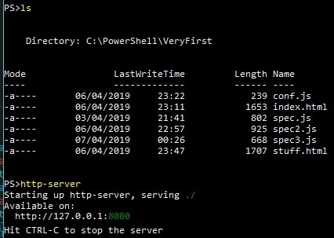
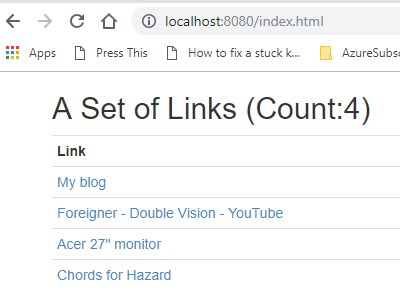

# ProtractorSandbox

To run the tests, in a command window, type: 
<b>protractor conf.js</b>

This assumes that
<ol>
  <li> you have a file conf.js in the current directory, </li>
  <li> for anything to happen, that conf.js references a spec2.js (right now) </li>
</ol>

A quick way of running up an http server for testing how your Protractor/Selenium code plays with html/angular is:
<pre>
npm install http-server -g
http-server
</pre>
The http server takes its home directory to be the one from where you invoked it. So given this...

... both of the files index.html and stuff.html will be found by a local browser:

